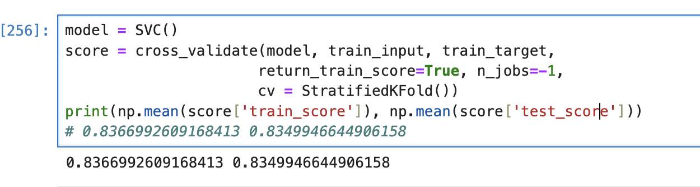

# 타이타닉 생존자 예측 

## 결측치 처리 
- train 데이터셋에는 Age,Cabin,Embarked 컬럼에 대한 결측지 존재 확인
- test 데이터셋에서는 Age,Fare,Cabin 컬럼에 대한 결측치 존재 확인

## EDA 진행 -> 변수마다 상관관계와 값의 분포 확인
PassengerId, Name, Ticket은 생존과의 연관성이 없다고 판단하여 EDA를 진행하지 않음. 
- survived : 사망 비율 61.6%, 생존 비율 38.4%로 사망한 탑승객이 더 많은 것을 확인 가능
- sex : 남성의 탑승자 수가 더 많기는 하지만 생존자 수는 여성이 더 많은 것으로 확인 가능
> 여성의 생존률은 74.2%, 남성의 생존률은 18.9% 
- Pclass : 1등석의 생존률은 약 63%, 2등석 47.3%, 3등석 24.2% 로 확인 가능, 또한 3등석의 탑승객이 가장 많고,그 다음 1등석, 2등석 순이지만 1,2등석 사이에서는 그렇게 차이가 나지 않다는 것을 확인
> 1등석은 반 넘게 살았지만 3등석은 대부분 사망한 것으로 판단
- Age : 탑승객들의 평균 나이는 30세, 시각화해서 확인하면 주로 20~40세로 분포확인
> 생존률과 비교할 때, 어린 나이의 탑승객들이 생존률이 높고, 20~30세는 비슷함
- SibSp, Parch : 함께 탑승한 가족의 수, 혼자 탑승한 승객이 가장 많지만, 생존률로 확인해보았을 때 혼자 탑승한 사람들이 많이 사망한 것으로 보임.
- Embarked : S항구가 가장 탑승객이 많고, 많이 사망한 것으로 보임. 
> 항구별 사망비율을 볼 때도, S항구가 가장 높았음. 

이를 확인하기 위해 PClass와 Embarked를 연관지어 탑승객들의 분포를 확인함. 

> 확인 결과, 3등석에는 S항구 탑승객들이 많은것으로 확인됨. 앞서 볼 때 3등석에 사망자가 많은 것으로 보아 간단히 유추할 때 S항구에서 탑승한 사람들이 3등석을 많이 예매했을 시대적 배경도 예상할 수 있음. 그 외에도 혼자 탑승한 탑승객의 수도 S 항구가 압도적으로 많음을 확인할 수 있었음.
- Fare : 탑승 금액이 적은 쪽은 사망률이 높은 것으로 확인 됨. 

## 머신러닝을 위한 준비 단계 
1. 결측치 처리 진행
- Sex : Sex는 male과 femal로 나누어져있어서 이를 0과 1로 변경
- Age : 177개의 결측치로 무시하기엔 너무 큰 값이라고 판단, 여성에게는 여성 나이의 평균, 남성은 남성 나이의 평균을 집어넣었음.
> 여성의 평균 나이 : 28세, 남성의 평균 나이 : 31세 
Age의 카테고리화 진행 
0 과 1 차이로 나누기에는 전체적인 범주로 나누기 위해 AgeRange 컬럼에 5개를 범위로 나누어 저장하여 16의 배수의 값들로 지정, 그렇게 한 이후에 drop 
- Name : Mr,Mrs,Miss 외에는 따로 예측에 도움이 되지 않을 것 같아 Other로 지정하여 저장
새로 Title_name 컬럼을 지정.
- Family : SibSp, Parch 는 단순히 가족이 있으 경우에 사망예측으로 확인하고 싶어 두 개의 값을 총합 한 값으로 새로운 컬럼을 지정
- Embakred : 결측치 2개는 최빈값인 S로 지정, 그 이후 S,C,Q를 0,1,2 로 인코딩
- Cabin : 알파벳처음으로 지정하고 수치화해서 저장
- Fare : 단순화를 위한 4가지의 범위로 기준 (Age랑 동일)
그 외에는 필요없는 컬럼들 drop (PassengerId, Ticket, Cabin)

## 모델링
모델링은 라이브러리를 다 불러와 하나씩 수행하면서 확인

KNN, Gradient Boosting, SVM 성능이 가장 높았고, 최종 모델로는 KNN을 지정하여 약 80%의 정확도를 가질 수 있었음. 

### 모델링 방법들 정리 노트
1. KNN(K-Nearest Neighbors) 알고리즘 
: 유사한 데이터를 기반으로 예측을 수행하는 비모수적 기계 학습 알고리즘으로 가장 가까운 K개의 데이터 포인트를 찾아서 그들의 레이블을 기반으로 예측을 함. 분류와 회귀 문제에 사용하기에 적합
> K : 이웃의 수를 나타내어, 3개의 이웃을 찾고 다수결 또는 평균값을 기반으로 예측을 수행함. 

> 거리측정 : 거리를 계산하여 가장 가까운 이웃을 찾아서, 유클리드 거리의 방법을 주로 사용함. (두 점사이의 직선 거리 계산하는 방법하는 과정과 같음)

- 장점: 간단하고, 직관적이며, 학습 시간이 빠르고, 비모수적이기에 모델에 대한 가정이 필요하지 않음.
- 단점: 예측 시간은 느리고, 학습데이터를 다 저장해야하기 때문에 메모리 사용량이 많아 성능에 안좋음. 

2. Decision Tree 알고리즘
: 결정트리는 트리 구조를 사용하여 데이터를 분할하고, 이를 통해 예측을 수행함. 노드, 간선, 리프 노드로 각각의 트리에 대하여 노드에서 데이터를 분할하는 기준을 선택함. (여기서는 주로 정보이득, 지니 불순도, 분산 등을 기준으로 기준을 삼음)

- 장점: 모델 해석이 용이하고, 특성 스케일링이 필요하지 않아서 다양한 데이터 유형을 처리 가능함.
- 단점 : 과적합 문제로 트리의 깊이가 깊어지면, 즉 Max_depth 가  길수록 탐색이 어렵고, 불균형 불안정할 수 있음. 편향된 데이터를 탐색하기에 힘들다.

3. Random Forest 알고리즘
: 앞 알고리즘은 결정 트리를 기반으로 하는 앙상블 학습 방법 중 하나, 여러 개의 결정 트리를 학습시켜서 최종 예측을 수행함. 과적합 문제의 단점을 해결해주는 알고리즘, 사용 방법으로는 배깅(Bootstrap Aggregating)을 사용함. 각 트리에서 나온 예측을 다수결 방식으로 최종 예측을 생성함.

- 장점 : 높은 정확도와 과적합을 방지해주고, 비선형 관계여도 잘 학습이 가능함. 
- 단점 : 해석하기가 어렵고 많은 트리를 학습시키기에 성능적으로 비용이 많이 든다. 

4. Gradient Boosting 알고리즘
: 앙상블 학습의 한 종류로 결정 트리를 순차적으로 학습시켜 오차를 보정해나가는 방식으로 성능을 개선해나가는 방식으로 오차 최소화를 목표로함. 배깅이 아니라 순차적 학습으로 이전 모델에서 발생한 오차를 보완하는 방향으로 학습 

- 장점 : 높은 정확도와 과적합을 방지하고, 유연한 특징이 존재
- 단점 : 학습 속도가 상대적으로 느리고, 해석하기가 어렵고 순차적인 학습으로 인해 병렬화가 어려움 -> 성능적으로도 불리함

5. HistGradientBoosting 
: GradinetBoosting의 효율적인 버전으로, 히스토그램 방식으로 처리하여 메모리 사용량을 줄이고, 학습 속도를 크게 향상시킴. 대규모 데이터셋에 적합함. 정확도를 좀 줄이더라도 성능적인 면에서 높은 효율을 다룰 수 있음. 

6. Naive Bayes 알고리즘
: 확률론적 분류 알고리즘, 베이즈 정리를 기반으로 특성들 간의 독립성을 가정하는 특성을 지님. 주로 현실에서 사용하지는 않음.
> 베이즈 정리 : 조건부 확률을 기반으로 하는 원리, 어떤 사건이 주어질 때 다른 사건이 일어나는 확률을 계산하는 방법
이 알고리즘은 주어진 특성들이 독립적이라고 가정하여 특성이 특정 클래스에 속할 확률을 계산하는 방법을 활용함. 즉, 최대 사후 확률을 구하는 방식으로 분류를 수행함. 

- 장점 : 간단하고 빠르고 독립성을 가정하기에 메모리에 효율적이다. 
- 단점 : 독립하다고 가정하는 것은 현실적이지 않기에 다양한 데이터에 제한적이고 주로 실수형으로 데이터가 복잡할 때에는 처리 하기 어려움.

7. SVM(Support Vector Machine) 알고리즘
: 강력한 분류 알고리즘으로 최적의 경계를 찾아서 데이터를 분류하는 방식, 고차원, 선형, 비선형 데이터 모두에 활용이 가능함. 주로 이진 분류 문제에서 사용함. 
> 두 클래스를 나누는 초 평면을 찾는 것을 목표 : 타이타닉 생존자 분류처럼 0,1을 찾는 경계선이 가장 중요함. 두 클래스를 분류하는 거리를 최대하해서 제일 좋은 일반화를 찾는 방식으로 진행

- 장점 : 효율적이고, 최적화에 좋아서 과적합 문제가 거의 없음.
- 단점 : 훈련 시간이 느려서 데이터가 클 경우에는 훈련시간이 길어질 수 있음. 초평면의 경계를 찾기 어렵기 때문에 해석하기에 어렵고, 하이퍼파라미터에 대한 튜닝이 필요함.